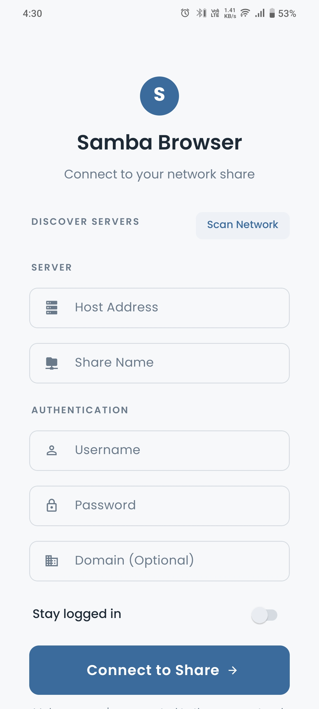
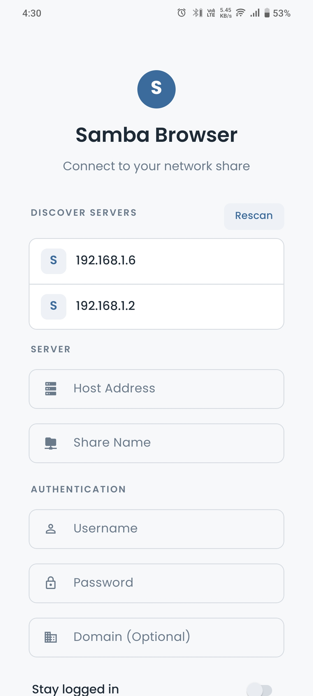
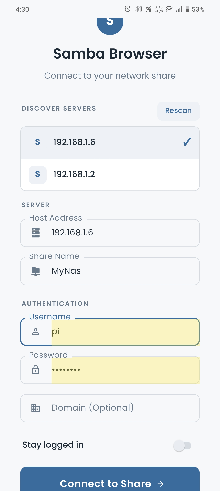
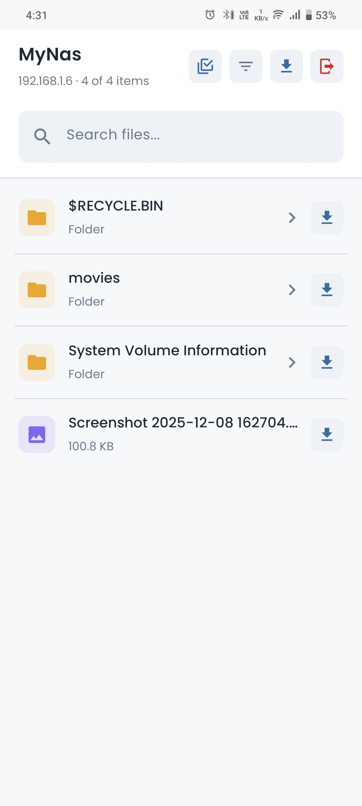
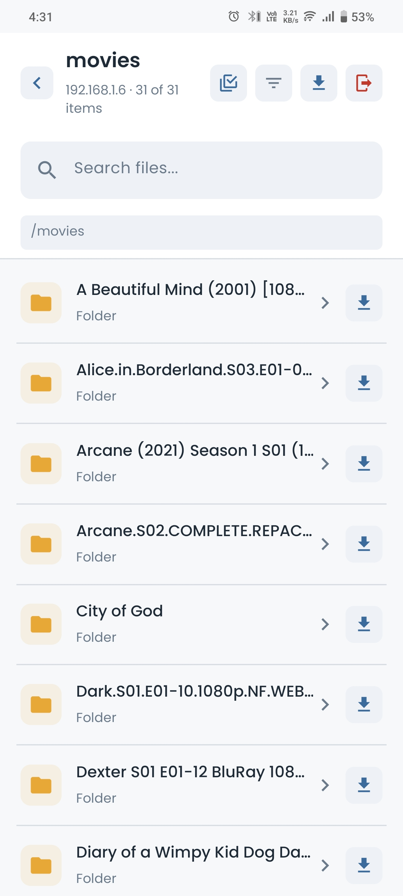

# Samba File Browser App

A React Native Android application for browsing and downloading files from Samba (SMB) network shares.

## Screenshots

<p align="center">
  
  
  
  
  
</p>

## Project Structure

This is a bare React Native project (not Expo) configured for Android-only development.

### Directory Structure

```
SambaFileBrowser/
├── android/                          # Android native code
│   └── app/src/main/java/com/sambafilebrowser/
│       ├── smb/                      # SMB native module
│       │   ├── SmbModule.kt          # Native module implementation
│       │   └── SmbPackage.kt         # Module package registration
│       ├── MainActivity.kt           # Main activity
│       └── MainApplication.kt        # Application entry point
├── src/
│   ├── components/                   # React components
│   ├── screens/                      # Screen components
│   ├── native/
│   │   └── SmbModule.ts              # TypeScript bridge to native module
│   ├── types/
│   │   └── index.ts                  # TypeScript type definitions
│   └── utils/                        # Utility functions
├── __tests__/                        # Test files
├── App.tsx                           # Root component
├── index.js                          # App entry point
├── package.json                      # Dependencies
└── tsconfig.json                     # TypeScript configuration
```

## Technology Stack

- **React Native 0.84.1** (bare workflow)
- **TypeScript** for type safety
- **Kotlin** for native Android module
- **SMBJ Library** for SMB protocol support (to be added)

## Requirements

- Node.js >= 22.11.0
- Android SDK
- JDK 17 or higher

## Getting Started

### Install Dependencies

```bash
npm install
```

### Run on Android

```bash
npm run android
```

### Development

```bash
# Start Metro bundler
npm start

# Run linter
npm run lint

# Run tests
npm test
```

## Configuration

- **Android Only**: iOS folder has been removed as this project targets Android exclusively
- **TypeScript**: Strict mode enabled with proper compiler options
- **Native Module**: SmbModule registered in MainApplication.kt for SMB operations

## Next Steps

The project structure is set up. Subsequent tasks will:
1. Add SMBJ library dependency
2. Implement SMB native module functionality
3. Build UI components
4. Add navigation
5. Implement file browsing and download features

